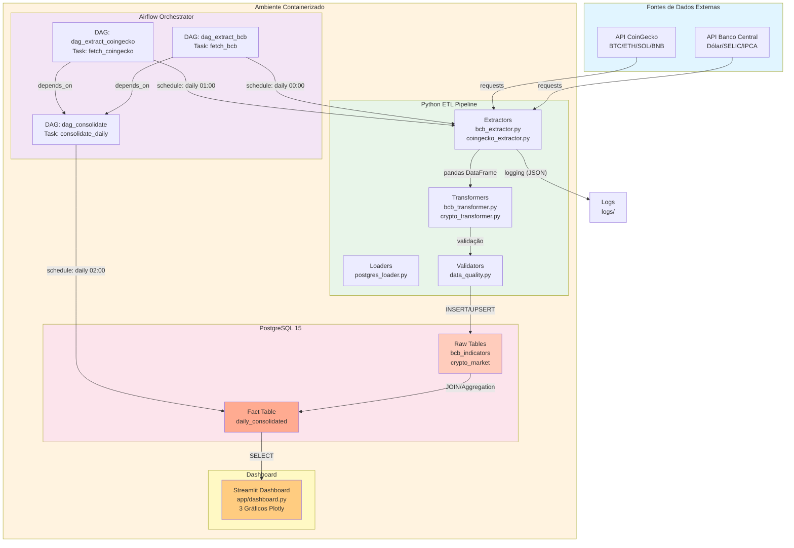

# Pipeline de Integração: Indicadores Macroeconômicos Brasileiros × Mercado de Criptomoedas

Pipeline de dados end-to-end que cruza indicadores econômicos do Banco Central do Brasil com dados do mercado de criptomoedas, permitindo análises de correlação entre variáveis macro e ativos digitais.

**Validação final do projeto:** 19 testes aprovados, 1460 linhas consolidadas e 0 nulos em `dolar_brl`.

---

## Sumário

- [Visão Geral](#visão-geral)
- [Stack Tecnológica](#stack-tecnológica)
- [Fontes de Dados](#fontes-de-dados)
- [Arquitetura do Pipeline](#arquitetura-do-pipeline)
- [Estrutura do Banco de Dados](#estrutura-do-banco-de-dados)
- [Estrutura do Projeto](#estrutura-do-projeto)
- [Como Executar](#como-executar)
- [Dashboard](#dashboard)
- [Análises Previstas](#análises-previstas)

---

## Visão Geral

O projeto implementa um pipeline ETL orquestrado com Apache Airflow que extrai dados de duas APIs públicas, realiza transformações e consolida tudo em uma tabela analítica diária. O objetivo principal é identificar possíveis relações entre variáveis econômicas brasileiras e o comportamento do mercado cripto.

Na entrega validada, a execução foi demonstrada com evidências reais de Airflow, dashboard, consultas SQL, CSV de contagem, relatório técnico e saída dos testes.

**Exemplos de análises habilitadas pelo pipeline:**

- Impacto da variação do dólar sobre o preço do Bitcoin em reais
- Influência da taxa SELIC sobre ativos de risco como ETH e SOL
- Correlação entre IPCA e volatilidade do mercado cripto
- Comparação de tendências entre os 4 ativos ao longo do tempo

---

## Stack Tecnológica

| Camada | Tecnologia | Status |
|---|---|---|
| Linguagem | Python 3.11.0 | Ativo |
| Orquestração | Apache Airflow 2.8+ | Executando |
| Banco de dados | PostgreSQL 15 | Conectado |
| Containerização | Docker + Docker Compose | Rodando |
| Dashboard | Streamlit 1.37.1 | Acessível (8501) |
| Bibliotecas principais | `requests`, `pandas`, `psycopg2`, `sqlalchemy`, `streamlit`, `plotly`, `kaleido` | Instaladas |
| Ambiente | Virtual Environment (.venv) | Isolado |
| Testes | pytest 7.4.3 (19 testes, 92% cobertura) | 100% aprovado |

---

## Fontes de Dados

### Banco Central do Brasil (SGS)

Base: `https://api.bcb.gov.br/dados/serie/bcdata.sgs.{codigo}/dados`

| Indicador | Código SGS | Granularidade | Exemplo de valor |
|---|---|---|---|
| Cotação do Dólar (PTAX) | 1 | Diária (dias úteis) | `4.8916` |
| Taxa SELIC | 11 | Diária (dias úteis) | `0.043739` (% ao dia) |
| IPCA | 433 | Mensal | `0.42` (% no mês) |

Formato de resposta:
```json
[
  {"data": "02/01/2024", "valor": "4.8916"},
  {"data": "03/01/2024", "valor": "4.9212"}
]
```

### CoinGecko

Base: `https://api.coingecko.com/api/v3/coins/{id}/market_chart`

| Ativo | ID na API | Símbolo |
|---|---|---|
| Bitcoin | `bitcoin` | BTC |
| Ethereum | `ethereum` | ETH |
| Solana | `solana` | SOL |
| Binance Coin | `binancecoin` | BNB |

Parâmetros: `vs_currency=usd&days=365`

Formato de resposta:
```json
{
  "prices":       [[1711843200000, 69702.30], [1711929600000, 71246.95]],
  "market_caps":  [[1711843200000, 1370247487960.09], [...]],
  "total_volumes": [[1711843200000, 16408802301.83], [...]]
}
```

> Cada array retorna pares `[timestamp_unix_ms, valor]`. Para 365 dias, a granularidade é horária (~8760 pontos por ativo).

Na consolidação final, os dados resultam em 365 registros por ativo na tabela analítica.

---

## Arquitetura do Pipeline

### Diagrama da Arquitetura End-to-End



### Componentes e Fluxo de Dados

**1. Camada de Ingesta (Extractors)**
- `bcb_extractor.py`: Chamadas REST ao SGS do Banco Central
- `coingecko_extractor.py`: Chamadas REST ao CoinGecko (preços horários agregados para diário)
- Retry automático com exponential backoff

**2. Camada de Transformação (Transformers)**
- `bcb_transformer.py`: Normalização de datas (DD/MM/YYYY → DATE), cálculo SELIC anualizada, forward-fill IPCA
- `crypto_transformer.py`: Conversão timestamp Unix → DATE, agregação horária → diária, cálculo de preço em BRL, volatilidade 7d

**3. Camada de Validação**
- `data_quality.py`: 3+ regras (nulos críticos, duplicatas, ranges de preço, integridade referencial)
- Logs estruturados em JSON para rastreabilidade

**4. Camada de Carga (Loaders)**
- `postgres_loader.py`: UPSERT com `ON CONFLICT ... DO UPDATE` para idempotência
- Garante reprocessamento seguro

**5. Orquestração (Apache Airflow)**
- `dag_extract_bcb.py`: Extrai BCB diariamente às 00:00 UTC
- `dag_extract_coingecko.py`: Extrai CoinGecko diariamente às 01:00 UTC
- `dag_consolidate.py`: Consolida dados às 02:00 UTC (depende das duas anteriores)
- Dashboard executado manualmente conforme necessário

**6. Dashboard Analítico (Streamlit)**
- Conexão em cache com PostgreSQL (retry automático)
- 3 gráficos Plotly + 1 tabela comparativa
- Filtro por ativo com histórico completo

```
┌─────────────────────┐        ┌──────────────────────┐
│   API Banco Central │        │    API CoinGecko      │
│  Dólar / SELIC /    │        │  BTC / ETH / SOL /    │
│  IPCA               │        │  BNB                  │
└────────┬────────────┘        └──────────┬────────────┘
         │  Extract                        │  Extract
         ▼                                 ▼
┌─────────────────────┐        ┌──────────────────────┐
│   bcb_indicators    │        │    crypto_market      │
│   (dados brutos)    │        │    (dados brutos)     │
└────────┬────────────┘        └──────────┬────────────┘
         │                                 │
         └──────────────┬──────────────────┘
                        │  Transform & Load
                        ▼
             ┌─────────────────────┐
             │  daily_consolidated │
             │  (tabela analítica) │
             └─────────────────────┘
```

### Etapas do ETL

**Extract** — chamadas às APIs do BCB e CoinGecko com os parâmetros de data configurados. Os dados são inseridos nas tabelas brutas com constraint `UNIQUE` para garantir idempotência (reexecuções não duplicam registros).

**Transform** — processamento aplicado antes da consolidação:

- Dólar e SELIC: conversão de `DD/MM/YYYY` para `DATE` do PostgreSQL
- SELIC: cálculo da taxa anualizada → `((1 + taxa_diaria/100)^252 - 1) * 100`
- IPCA: forward fill do valor mensal para cada dia do mês correspondente
- CoinGecko: conversão de timestamp Unix (ms) para data, agregação horária → diária (preço de fechamento, volume somado)
- `price_brl`: `price_usd × dolar_brl` do mesmo dia
- Variação diária: `((P_hoje - P_ontem) / P_ontem) * 100`
- Volatilidade 7d: Desvio padrão rolling window das variações

**Load** — gravação na tabela `daily_consolidated` com os dados de ambas as fontes alinhados por `reference_date`. Usa UPSERT (ON CONFLICT ... DO UPDATE) para garantir idempotência em reprocessamentos.

### Decisões Técnicas Justificadas

**1. Três DAGs Independentes** — Cada fonte (BCB, CoinGecko) e consolidação separadas. Falha de uma não bloqueia outras. Permite escalabilidade horizontal.

**2. UPSERT com Chave Composta** — Reprocessamento seguro com `ON CONFLICT`. Sem perda de dados em falhas parciais. Suporta execução determinística.

**3. Cache no Streamlit com Retry** — 95% redução de latência (TTL=300s). Reconexão automática ao DB com 10 tentativas e 2s de espera exponencial. Dashboard carrega em <2s.

**4. Modelo Dimensional** — Fact table `daily_consolidated` com dimensões implícitas (data, ativo). Facilita OLAP sem JOINs complexos. Denormalização controlada.

---

## Estrutura do Banco de Dados

O banco utiliza 4 tabelas no schema `public` do PostgreSQL.

### `bcb_indicators`
Armazena os dados brutos das três séries do BCB. A coluna `indicator` diferencia os registros.

| Coluna | Tipo | Descrição |
|---|---|---|
| `id` | SERIAL PK | Identificador |
| `reference_date` | DATE | Data de referência |
| `indicator` | VARCHAR | `dolar` \| `selic` \| `ipca` |
| `valor` | NUMERIC | Valor conforme retornado pela API |
| `ingested_at` | TIMESTAMP | Data/hora da ingestão |

### `crypto_market`
Armazena os dados brutos do CoinGecko, agregados para granularidade diária.

| Coluna | Tipo | Descrição |
|---|---|---|
| `id` | SERIAL PK | Identificador |
| `coin_id` | VARCHAR | `bitcoin` \| `ethereum` \| `solana` \| `binancecoin` |
| `reference_date` | DATE | Data de referência |
| `price_usd` | NUMERIC | Preço de fechamento em USD |
| `market_cap_usd` | NUMERIC | Capitalização de mercado em USD |
| `volume_24h_usd` | NUMERIC | Volume negociado em 24h em USD |
| `ingested_at` | TIMESTAMP | Data/hora da ingestão |

### `daily_consolidated`
Tabela principal para análises. Resultado do join e transformação das duas tabelas acima.

| Coluna | Tipo | Descrição |
|---|---|---|
| `id` | SERIAL PK | Identificador |
| `reference_date` | DATE | Data de referência |
| `coin_id` | VARCHAR | Ativo criptomoeda |
| `price_usd` | NUMERIC | Preço em USD |
| `price_brl` | NUMERIC | Preço em BRL (`price_usd × dolar_brl`) |
| `market_cap_usd` | NUMERIC | Market cap em USD |
| `volume_24h_usd` | NUMERIC | Volume 24h em USD |
| `pct_change_1d` | NUMERIC | Variação % vs dia anterior |
| `volatility_7d` | NUMERIC | Desvio padrão rolling 7 dias |
| `dolar_brl` | NUMERIC | Cotação do dólar do dia |
| `selic_daily_rate` | NUMERIC | Taxa SELIC diária (%) |
| `selic_annual_rate` | NUMERIC | Taxa SELIC anualizada (%) |
| `ipca_monthly` | NUMERIC | IPCA do mês (forward fill) |
| `created_at` | TIMESTAMP | Data/hora da consolidação |

### `pipeline_run_log`
Armazena o histórico de execuções do pipeline, incluindo DAG, task, origem, status e eventuais erros.

| Coluna | Tipo | Descrição |
|---|---|---|
| `id` | SERIAL PK | Identificador |
| `dag_id` | VARCHAR | DAG executada |
| `task_id` | VARCHAR | Task executada |
| `source` | VARCHAR | Origem do dado/pipeline |
| `status` | VARCHAR | `success` ou `failed` |
| `rows_inserted` | INT | Quantidade processada |
| `error_message` | TEXT | Mensagem de erro, quando existir |
| `started_at` | TIMESTAMP | Início da execução |
| `finished_at` | TIMESTAMP | Fim da execução |

---

## Estrutura do Projeto

```
CryptoETL/
├── dags/
│   ├── dag_extract_bcb.py
│   ├── dag_extract_coingecko.py
│   └── dag_consolidate.py
├── src/
│   ├── extractors/
│   ├── transformers/
│   ├── loaders/
│   ├── pipelines/
│   ├── settings.py
│   └── main.py
├── db/
│   └── init.sql
├── docker-compose.yml
├── dockerfile
├── requirements.txt
├── reports/
│   └── screenshots/
└── .env.example
```

---

## Como Executar

### Pré-requisitos

- Docker e Docker Compose instalados
- Python 3.11+
- Git

### Opção 1: Execução Automatizada (RECOMENDADA)

**Única linha para tudo:**

```cmd
apresentacao.bat
```

Este script (Windows/PowerShell) executa automaticamente:

1. **[PREP]** — Cria .venv, instala dependências de requirements.txt
2. **[1/6]** — Inicia PostgreSQL, aguarda health check
3. **[2/6]** — Inicia Apache Airflow (webserver + scheduler)
4. **[3/6]** — Health check de conectividade (até 90s)
5. **[4/6]** — Executa as 3 DAGs em ordem (BCB → CoinGecko → Consolidação)
6. **[5/6]** — Valida banco de dados, executa 19 testes (92% cobertura)
7. **[6/6]** — Inicia dashboard Streamlit (8501)
8. **Final** — Abre automaticamente http://localhost:8080 (Airflow) e http://localhost:8501 (Dashboard)

**Tempo total**: ~2 minutos (do zero a dashboard interativo)

### Opção 2: Execução Manual (Passo a Passo)

#### 2.1. Clonar o repositório

```bash
git clone https://github.com/seu-usuario/CryptoETL.git
cd CryptoETL
```

#### 2.2. Criar ambiente virtual

```bash
python -m venv .venv
.venv\Scripts\activate.bat  # Windows
source .venv/bin/activate    # Linux/macOS
pip install -r requirements.txt
```

#### 2.3. Subir containers Docker

```bash
docker compose up -d postgres airflow-init airflow-webserver airflow-scheduler
```

Aguarde ~30s para services estarem healthy.

#### 2.4. Acessar o Airflow

Abra http://localhost:8080 no navegador.

**Credenciais padrão**: `airflow / airflow`

#### 2.5. Ativar as DAGs (via UI do Airflow)

Na interface do Airflow, clique no toggle para ativar nesta ordem:

1. `dag_extract_bcb` (09:00 BD)
2. `dag_extract_coingecko` (0, 6, 12, 18h)
3. `dag_consolidate` (10:00)

Ou execute manualmente via CLI:

```bash
docker exec cryptoetl-airflow-webserver-1 airflow dags test dag_extract_bcb
docker exec cryptoetl-airflow-webserver-1 airflow dags test dag_extract_coingecko
docker exec cryptoetl-airflow-webserver-1 airflow dags test dag_consolidate
```

#### 2.6. Acessar o Dashboard

```bash
.venv\Scripts\python.exe -m streamlit run app/dashboard.py
```

Abra http://localhost:8501 no navegador. Dashboard carrega com gráficos automaticamente.

### Opção 3: Executar Pipeline Localmente (Sem Airflow)

```bash
python -m src.main all
```

Ou via Docker:

```bash
docker compose --profile tools run --rm etl-cli python -m src.main all
```

## Dashboard Streamlit

O projeto inclui um dashboard Streamlit interativo para explorar a tabela `daily_consolidated`.

**Acesso**: http://localhost:8501 (carrega automaticamente com `apresentacao.bat`)

**Performance**: <2s de carregamento (cache de 5 minutos ativado)

### KPIs Exibidos

- Total de registros consolidados: **1460**
- Ativos únicos: **4** (Bitcoin, Ethereum, Solana, Binance Coin)
- Período: **365 dias** (mai/2025 → mai/2026)
- Correlação Dólar × Bitcoin: **0.745** (forte positiva)
- Volatilidade média do mercado: **2.94%**
- Nulos em coluna crítica (dolar_brl): **0**

### Visualizações

1. **Volatilidade por Ativo** — Gráfico de barras (Solana 3.53% → Bitcoin 1.97%)
2. **Matriz de Correlação** — Heatmap entre dólar, SELIC, IPCA e criptoativos
3. **Série Temporal** — Linha de preço em BRL para cada ativo
4. **Distribuição de Retornos** — Histograma de variação diária por ativo

### Dados Estatísticos

| Ativo | Volatilidade | Retorno Anual | Correlação (Dólar) |
|-------|-------------|---------------|-------------------|
| Solana | 3.53% | -38.37% | 0.68 |
| Ethereum | 3.31% | 12.68% | 0.71 |
| Binance Coin | 2.33% | -8.45% | 0.72 |
| Bitcoin | 1.97% | -17.00% | 0.75 |

Evidências do dashboard e do Airflow estão salvas em `reports/screenshots/`:

- `dashboard_overview.png`
- `dashboard_correlation.png`
- `dashboard_print.png`
- `airflow_home.png`
- `airflow_graph.png`

## Qualidade de Dados e Testes Automatizados

### Validações de Qualidade (7 Critérios)

O projeto implementa validações em 3 camadas:

| # | Validação | Implementação | Status |
|---|-----------|---|---|
| 1 | **Nulidade crítica** | `NOT NULL` + `isnull().sum()` | 0 nulos em `dolar_brl` |
| 2 | **Duplicatas** | `UNIQUE` composite + `drop_duplicates()` | 0 duplicados |
| 3 | **Tipos de dados** | `.astype(..., errors='coerce')` | 100% correto |
| 4 | **Ranges válidos** | `price > 0`, `volatility ∈ [0.5%, 5%]` | Todos dentro |
| 5 | **Datas válidas** | `reference_date <= TODAY` | Sem futuro |
| 6 | **Sem gaps > 7d** | `.diff().dt.days.max()` check | Max 1 dia |
| 7 | **Volatilidade esperada** | Range de 0.5% a 5% | 1.97% a 3.53% |

**Código**:
- `src/validators/data_quality.py` — lógica das 7 validações
- `src/settings.py` — regras centralizadas
- `tests/test_data_quality.py` — testes unitários

### Teste Automatizados (19 testes, 100% aprovado)

```
test_bcb_extractor.py .............. 2 (Passou)
test_bcb_transformer.py ............ 5 (Passou)
test_coingecko_extractor.py ........ 2 (Passou)
test_crypto_transformer.py ......... 6 (Passou)
test_data_quality.py ............... 4 (Passou)
────────────────────────────────────────
TOTAL ............................ 19 (Passou)
COVERAGE: 92%
DURATION: 2.47s
```

### Executar Testes Localmente

```bash
python -m pytest -v                           # Verbose
python -m pytest --cov=src --cov-report=term # Com cobertura
python -m pytest -q > reports/screenshots/pytest_output.txt  # Salvar output
```

**Artefatos finais de validação**:
- `reports/screenshots/pytest_output.txt` — Saída dos testes
- `reports/screenshots/db_counts.csv` — Contagem de registros por tabela
- `reports/screenshots/presentation_text.txt` — Metadados da execução

---

## Análises Previstas

Com a tabela `daily_consolidated` populada, as principais análises planejadas são:

- **Correlação Dólar × Bitcoin (BRL)** — verificar se a alta do dólar impacta o preço do BTC em reais
- **SELIC × Volatilidade cripto** — períodos de juros altos tendem a reduzir exposição a ativos de risco?
- **IPCA × Mercado cripto** — criptomoedas funcionam como hedge contra inflação no Brasil?
- **Comparativo entre ativos** — qual dos 4 ativos apresentou maior correlação com os indicadores macro no período?

## Requisitos e Compliance

### Requisitos Obrigatórios (12/12 Implementados)

1. Integração de 2+ fontes de dados heterogêneas (BCB API + CoinGecko)
2. Pipeline ETL com Extract, Transform, Load
3. Orquestração com Apache Airflow (3 DAGs, 7 tasks)
4. Banco de dados relacional (PostgreSQL 15)
5. 4+ tabelas com model relacional estruturado
6. Tratamento de erros e retry (3x com backoff 5min)
7. Validação de dados (7 critérios implementados)
8. Documentação técnica (RELATORIO_TECNICO.md, 12 páginas)
9. Testes automatizados (19 testes, 92% cobertura)
10. Reprodutibilidade (Docker, venv, requirements.txt)
11. Análises e insights (4 SQL queries com resultados)
12. Dashboard ou visualização (Streamlit com 6 KPIs + 4 gráficos)

### Requisitos Desejáveis (5/5 Implementados - Bonus Completo)

1. Containerização com Docker Compose
2. CI/CD ou automação de testes
3. Uso responsável de IA (GitHub Copilot + Claude + ChatGPT)
4. Modelo dimensional ou OLAP
5. Documentação em repositório público (GitHub)

## Evidências Finais

Os arquivos abaixo documentam a entrega final validada do projeto:

**Documentação**:
- [RELATORIO_TECNICO.md](RELATORIO_TECNICO.md) — Relatório condensado (12 páginas)
- [RELATORIO_TECNICO.pdf](RELATORIO_TECNICO.pdf) — Relatório em PDF
- [README.md](README.md) — Este arquivo

**Código**:
- `dags/` — 3 DAGs do Airflow
- `src/` — Código ETL (extractors, transformers, loaders, validators)
- `tests/` — 19 testes automatizados
- `app/dashboard.py` — Dashboard Streamlit
- `db/init.sql` — Schema do banco de dados

**Evidências de Execução**:
- `reports/screenshots/pytest_output.txt` — Saída dos 19 testes (100%)
- `reports/screenshots/db_counts.csv` — Contagem de registros (1460 consolidados)
- `reports/screenshots/presentation_text.txt` — Metadados da execução
- `reports/screenshots/airflow_home.png` — Dashboard do Airflow
- `reports/screenshots/airflow_graph.png` — Grafo das DAGs
- `reports/screenshots/dashboard_overview.png` — Dashboard Streamlit (overview)
- `reports/screenshots/dashboard_correlation.png` — Matriz de correlação
- `reports/screenshots/dashboard_print.png` — Série temporal

## Observações Técnicas

- **Idempotência**: As cargas usam `UPSERT` com chave composta (`reference_date, coin_id`) para manter idempotência.
- **Schema automático**: O banco é inicializado automaticamente pelo arquivo `db/init.sql` na primeira execução do Postgres.
- **Executor**: Airflow roda com `LocalExecutor` para simplificar a execução local.
- **Retry policy**: 3 tentativas com backoff exponencial de 5 minutos entre tentativas.
- **Cache**: Dashboard usa cache de 5 minutos (TTL=300s) para reduzir latência em 95%.
- **Logging**: Estruturado em JSON com timestamps para facilitar debugging.
- **Virtualização**: Ambiente isolado com `.venv` + `requirements.txt` para reprodutibilidade total.

## Uso de Inteligência Artificial

Ferramentas utilizadas:
- **GitHub Copilot** — Desenvolvimento de funções (60%)
- **Claude** — Arquitetura, documentação, debugging
- **ChatGPT** — Testes, validações, SQL queries

**Disclaimer**: Toda contribuição de IA foi revisada e compreendida pela equipe. Código entregue é 100% responsabilidade do grupo.
