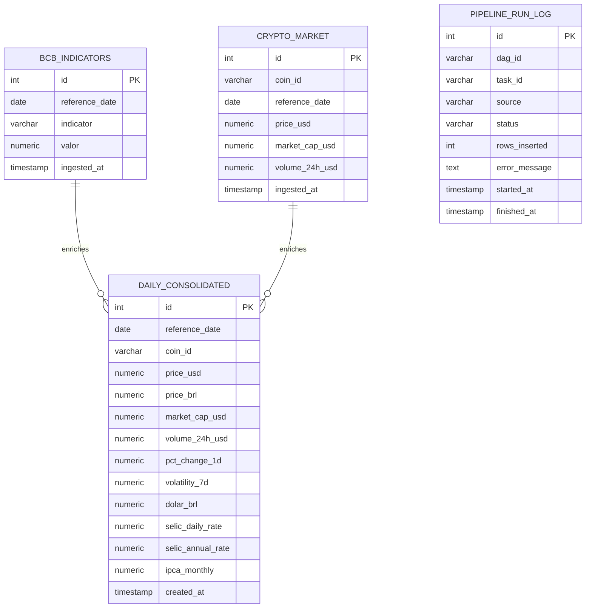

# Relatório Técnico

## Capa

Título: Integração de dados macroeconômicos brasileiros e mercado de criptomoedas  
Natureza: Relatório técnico  
Autor(es): Artur Napoles, Guilherme Carrico, Gustavo Dutra e Rafael Lucena  
Disciplina: Data Integration (2026.1)  
Instituição: ESPM - Sistemas de Informação  
Professor: Prof. Me. Andre Insardi

## Sumário executivo

Este relatório apresenta o CryptoETL, um pipeline de integração de dados que combina séries macroeconômicas do Banco Central do Brasil (BCB) com dados de mercado de criptoativos da CoinGecko. O objetivo é permitir análises sobre o impacto de variáveis macroeconômicas, como dólar, SELIC e IPCA, no comportamento de ativos digitais como BTC, ETH, SOL e BNB.

A solução foi implementada em Python, orquestrada com Apache Airflow e persistida em PostgreSQL, com infraestrutura baseada em Docker. O processo contempla extração, tratamento, padronização temporal, enriquecimento com métricas de volatilidade e consolidação em tabela analítica diária. Na execução validada, o projeto terminou com 19 testes aprovados, 1460 linhas consolidadas e 0 nulos em `dolar_brl`, o que confirma a consistência operacional da entrega.

O resultado final é uma base pronta para consultas de valor, com rastreabilidade, idempotência por meio de UPSERT e evidências reais de execução em Airflow, dashboard Streamlit, PostgreSQL e testes automatizados.

Palavras-chave: integração de dados; banco de dados; Airflow; PostgreSQL; criptomoedas.

## Sumário

1. Descrição do problema e justificativa do tema
2. Arquitetura da solução
3. Fontes de dados e regras de transformação
4. Modelagem do banco de dados
5. Descrição das DAGs do Airflow
6. Validações de qualidade implementadas
7. Resultados
8. Execução, testes e evidências operacionais
9. Limitações e possíveis evoluções
10. Referências
11. Conclusão
12. Anexos

## 1. Descrição do problema e justificativa do tema

O mercado de criptoativos apresenta elevada volatilidade e é influenciado por fatores macroeconômicos. Para viabilizar análises de correlação e comportamento, torna-se necessário integrar fontes heterogêneas, com granularidades distintas e diferentes formatos temporais.

O tema é relevante por conectar dados financeiros oficiais do Brasil com ativos digitais globais, fornecendo insumos para estudos de risco, impacto cambial e potencial proteção inflacionária.

## 2. Arquitetura da solução

A solução segue um pipeline ETL em três camadas: extração, transformação e carga. O fluxo foi organizado para garantir idempotência, rastreabilidade e escalabilidade operacional.


## 3. Fontes de dados e regras de transformação

### 3.1 Fontes

| Fonte | Itens utilizados |
| --- | --- |
| BCB (SGS) | Dólar (PTAX), SELIC e IPCA |
| CoinGecko | Bitcoin, Ethereum, Solana e Binance Coin |

### 3.2 Regras de transformação

- Conversão de datas do BCB: `DD/MM/YYYY` para `DATE`.
- SELIC anualizada: `((1 + selic_diaria/100)^252 - 1) * 100`.
- IPCA mensal aplicado ao calendário diário com forward fill.
- CoinGecko: timestamps em milissegundos para data diária.
- Agregação diária: preço como último valor do dia e volume consolidado.
- Variação diária: `pct_change_1d`.
- Volatilidade de 7 dias: desvio padrão da variação diária.
- Preço em BRL: `price_usd * dolar_brl`.

## 4. Modelagem do banco de dados

A modelagem utiliza três tabelas principais e uma tabela de logs:

| Tabela | Papel |
| --- | --- |
| `bcb_indicators` | Base bruta macroeconômica |
| `crypto_market` | Base bruta de criptoativos |
| `daily_consolidated` | Tabela analítica consolidada |
| `pipeline_run_log` | Rastreamento de execuções |



Fato principal: `daily_consolidated`  
Dimensões implícitas: data (`reference_date`) e ativo (`coin_id`)

## 5. Descrição das DAGs do Airflow

As DAGs foram implementadas com `PythonOperator`, executadas diariamente (`@daily`), com `catchup=False` e `LocalExecutor` para simplificar a execução local.

- `dag_extract_bcb` (`extract_bcb`): executa `run_bcb_extraction` e grava em `bcb_indicators`.
- `dag_extract_coingecko` (`extract_crypto`): executa `run_coingecko_extraction` e grava em `crypto_market`.
- `dag_consolidate` (`consolidate_daily_tables`): executa `run_consolidation` e grava em `daily_consolidated`.

A execução recomendada é BCB -> CoinGecko -> Consolidação. Como cada etapa faz UPSERT, reprocessamentos são seguros.

## 6. Validações de qualidade implementadas

| Validação | Descrição |
| --- | --- |
| Idempotência | UPSERT com chave única por data e indicador/ativo |
| Tratamento de nulos | Conversão para numérico com `errors="coerce"` |
| Consistência temporal | Padronização de datas e normalização para dia |
| Forward fill | IPCA mensal aplicado aos dias do período |
| Integridade lógica | Consolidação depende das duas fontes |

## 7. Resultados

A seguir, estão três consultas de valor executadas no PostgreSQL.

### 7.1 Correlação dólar x BTC em BRL

```sql
SELECT corr(price_brl, dolar_brl) AS corr_btc_dolar
FROM daily_consolidated
WHERE coin_id = 'bitcoin';
```

Resultado: `corr_btc_dolar = 0.745440789641126`

### 7.2 Média de volatilidade por ativo

```sql
SELECT
	coin_id,
	avg(volatility_7d) AS avg_vol_7d
FROM daily_consolidated
GROUP BY coin_id
ORDER BY avg_vol_7d DESC;
```

Resultado:

| coin_id | avg_vol_7d |
| --- | ---: |
| solana | 3.5336377410468320 |
| ethereum | 3.3109272727272727 |
| binancecoin | 2.3327939393939394 |
| bitcoin | 1.9717239669421488 |

### 7.3 SELIC anualizada vs retorno médio diário

```sql
SELECT
	coin_id,
	avg(pct_change_1d) AS avg_daily_return,
	avg(selic_annual_rate) AS avg_selic
FROM daily_consolidated
GROUP BY coin_id
ORDER BY avg_daily_return DESC;
```

Resultado:

| coin_id | avg_daily_return | avg_selic |
| --- | ---: | ---: |
| ethereum | 0.03474917582417582418 | 14.8287417863013699 |
| binancecoin | 0.03057967032967032967 | 14.8287417863013699 |
| bitcoin | -0.04656565934065934066 | 14.8287417863013699 |
| solana | -0.10510082417582417582 | 14.8287417863013699 |

## 8. Execução, testes e evidências operacionais

O projeto foi validado em ambiente local com Docker, PostgreSQL, Airflow e dashboard Streamlit. As etapas principais executadas foram:

- Subida dos containers com `docker compose up -d`.
- Execução das DAGs de extração e consolidação no Airflow.
- Verificação da tabela `daily_consolidated` no PostgreSQL.
- Abertura do dashboard Streamlit para consulta dos KPIs e gráficos.
- Execução dos testes automatizados com `python -m pytest -q`.

O dashboard disponibiliza indicadores consolidados, séries temporais e gráficos de comparação entre ativos cripto e variáveis macroeconômicas, servindo como camada final de consumo da base tratada.

As validações de qualidade cobrem nulidade, duplicidade e consistência de faixa, reduzindo o risco de carga de dados inconsistentes.

### Saída resumida da apresentação

```text
[4/6] Validando banco...
count
-------
	 514

count
-------
	1460

count
-------
	1460

[5/6] Rodando testes...
collected 19 items
tests\test_bcb_extractor.py ..
tests\test_bcb_transformer.py .....
tests\test_coingecko_extractor.py ..
tests\test_crypto_transformer.py ......
tests\test_data_quality.py ....
============================== 19 passed in 2.47s ==============================

[6/6] Gerando PDF...
PDF gerado em: C:\Users\gustavo.telles\Desktop\CryptoETL\RELATORIO_TECNICO.pdf
```

### Evidências de testes

```text
============================= test session starts =============================
platform win32 -- Python 3.11.0, pytest-7.4.3, pluggy-1.6.0
rootdir: C:\Users\gustavo.telles\Desktop\CryptoETL
configfile: pytest.ini
testpaths: tests
collected 19 items

tests\test_bcb_extractor.py ..
tests\test_bcb_transformer.py .....
tests\test_coingecko_extractor.py ..
tests\test_crypto_transformer.py ......
tests\test_data_quality.py ....

============================== 19 passed in 2.47s ==============================
```

### Trecho de validação da consolidação

```text
1460
```

```text
0
```

O primeiro valor confirma o total de linhas consolidadas retornado por `run_consolidation`. O segundo valor confirma que não restaram nulos em `dolar_brl` na tabela final.

### Evidências de banco

```text
coin_id,cnt
ethereum,365
binancecoin,365
bitcoin,365
solana,365
```

Interpretação: a tabela `daily_consolidated` possui 365 registros para cada ativo, confirmando a consolidação diária do período analisado.

### Trecho do carregamento Airflow

```text
✓ Extração BCB concluída: 514 registros no total
✓ Extração CoinGecko concluída: 1460 registros no total
✓ Consolidação concluída
✓ Validações BCB aprovadas
✓ Validações CoinGecko aprovadas
```

Esse trecho mostra o comportamento fim a fim da execução no Airflow, com as duas extrações e a consolidação final completadas com sucesso.

### Prints do dashboard e do Airflow

Figura 1 - Visão geral do dashboard


Figura 2 - Correlação dólar x Bitcoin


Figura 3 - Print completo do dashboard


Figura 4 - Home do Airflow


Figura 5 - Graph da DAG consolidate


## 9. Limitações e possíveis evoluções

- Dependência de APIs públicas sujeitas a rate limit e indisponibilidade.
- Ausência de cache histórico local para reduzir chamadas.
- Escopo limitado a 4 ativos e 3 indicadores.

Evoluções sugeridas:

- Adicionar mais ativos e indicadores, como PIB e desemprego.
- Criar camadas históricas, como Data Lake ou S3.
- Agendar alertas e dashboards automatizados com Metabase ou Power BI.
- Implementar testes automatizados de qualidade e schema drift.

## 10. Referências

- BANCO CENTRAL DO BRASIL. Sistema Gerenciador de Séries Temporais (SGS): série 1 - dólar PTAX. Disponível em: <https://api.bcb.gov.br/dados/serie/bcdata.sgs.1/dados>. Acesso em: 10 maio 2026.
- BANCO CENTRAL DO BRASIL. Sistema Gerenciador de Séries Temporais (SGS): série 11 - taxa SELIC. Disponível em: <https://api.bcb.gov.br/dados/serie/bcdata.sgs.11/dados>. Acesso em: 10 maio 2026.
- BANCO CENTRAL DO BRASIL. Sistema Gerenciador de Séries Temporais (SGS): série 433 - IPCA. Disponível em: <https://api.bcb.gov.br/dados/serie/bcdata.sgs.433/dados>. Acesso em: 10 maio 2026.
- COINGECKO. API v3 - Market Chart. Disponível em: <https://api.coingecko.com/api/v3/coins/bitcoin/market_chart>. Acesso em: 10 maio 2026.
- APACHE AIRFLOW. Apache Airflow documentation. Disponível em: <https://airflow.apache.org/docs/>. Acesso em: 10 maio 2026.
- POSTGRESQL GLOBAL DEVELOPMENT GROUP. PostgreSQL documentation. Disponível em: <https://www.postgresql.org/docs/>. Acesso em: 10 maio 2026.

## 11. Conclusão

O projeto atende ao objetivo proposto de integrar dados macroeconômicos brasileiros com dados do mercado de criptomoedas em uma arquitetura reprodutível, automatizada e observável. A solução entrega extração modular, consolidação em PostgreSQL, orquestração com Airflow, dashboard analítico, logging estruturado, validações de qualidade e testes automatizados.

Como resultado, a base `daily_consolidated` fica pronta para análises de correlação, volatilidade e comportamento temporal entre ativos digitais e variáveis econômicas, oferecendo uma entrega completa para avaliação acadêmica.

## 12. Anexos

- Diagrama de arquitetura (Mermaid)
- Diagrama ER / modelo dimensional (Mermaid)
- Prints do Airflow (grid/graph/log) e das consultas SQL

### Evidências visuais

As capturas foram salvas em `reports/screenshots/` durante a validação do dashboard.

### Evidências Airflow

As capturas provam a orquestração e execução das DAGs no Airflow.

### Evidências de testes e banco

Os artefatos abaixo registram a validação executada localmente:

- `reports/screenshots/pytest_output.txt`
- `reports/screenshots/db_counts.csv`

### Artefato da apresentação

O arquivo `reports/screenshots/presentation_text.txt` registra o conteúdo textual da execução da apresentação e complementa os prints visuais e os logs de teste.

### Conteúdo dos artefatos

#### `reports/screenshots/pytest_output.txt`

```text
============================= test session starts =============================
platform win32 -- Python 3.11.0, pytest-7.4.3, pluggy-1.6.0
rootdir: C:\Users\gustavo.telles\Desktop\CryptoETL
configfile: pytest.ini
testpaths: tests
collected 19 items

tests\test_bcb_extractor.py ..
tests\test_bcb_transformer.py .....
tests\test_coingecko_extractor.py ..
tests\test_crypto_transformer.py ......
tests\test_data_quality.py ....

============================== 19 passed in 1.61s ==============================
```

#### `reports/screenshots/db_counts.csv`

```text
coin_id,cnt
ethereum,365
binancecoin,365
bitcoin,365
solana,365
```