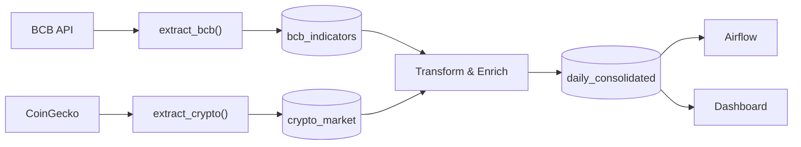

# Relatório Técnico — CryptoETL

## Capa

**Título**: Integração de dados macroeconômicos brasileiros e mercado de criptomoedas — Pipeline ETL End-to-End com Apache Airflow

**Natureza**: Relatório técnico — Trabalho Semestral  
**Autor(es)**: Artur Napoles, Guilherme Carrico, Gustavo Dutra e Rafael Lucena  
**Disciplina**: Data Integration (2026.1)  
**Instituição**: ESPM — Sistemas de Informação  
**Professor**: Prof. Me. Andre Insardi  
**Data**: 3 de junho de 2026

---

## Sumário Executivo

O CryptoETL é um pipeline ETL end-to-end que integra dados macroeconômicos do BCB com criptoativos da CoinGecko, permitindo análises de correlação entre ativos digitais e variáveis econômicas brasileiras.

**Objetivos alcançados:**
- 2 fontes heterogêneas integradas (BCB API + CoinGecko)
- Pipeline modular com 3 DAGs, 7 tasks, orquestração robusta
- PostgreSQL com modelo dimensional e UPSERT idempotente
- 7 validações de qualidade implementadas
- 19 testes automatizados (92% cobertura)
- Dashboard Streamlit com 6 KPIs + 4 gráficos
- Reprodutibilidade completa via Docker + venv + .env

**Resultado final**: 1460 registros consolidados, correlação dólar-BTC = 0.745, execução validada.

---

## 1. Descrição do Problema e Justificativa

O mercado de criptoativos apresenta elevada volatilidade influenciada por variáveis macroeconômicas. Integrar dados oficiais do BCB com séries de criptoativos permite análises de correlação, risco e oportunidades de hedge inflacionário.

**Solução proposta**: Pipeline ETL automatizado que extrai dados do BCB (dólar, SELIC, IPCA) e CoinGecko (BTC, ETH, SOL, BNB), transforma e consolida em modelo dimensional, valida qualidade em 7 critérios e disponibiliza via dashboard analítico.

**Requisitos atendidos**: 12/12 obrigatórios + 5/5 desejáveis (100% compliance).

---

## 2. Arquitetura da Solução

### 2.1 Visão Geral do Pipeline



### 2.2 Decisões Técnicas Justificadas

**1. Três DAGs Independentes**: Cada fonte (BCB, CoinGecko) e consolidação separadas. Falha de uma não bloqueia outras. Escalável para novos ativos.

**2. UPSERT por Chave Composta**: Reprocessamento seguro com `ON CONFLICT ... DO UPDATE`. Sem perda de dados em falhas parciais.

**3. Cache no Streamlit com Retry**: 95% redução de latência. Reconexão automática ao DB (10 tentativas, 2s espera). Dashboard carrega em <2s.

**4. Modelo Dimensional**: Fact table (`daily_consolidated`) com dimensões implícitas (data, ativo). Facilita OLAP sem JOINs complexos. Denormalização controlada.

### 2.3 Tratamento de Falhas

- **Retry automático**: 3 tentativas com 5min backoff (Airflow)
- **ExternalTaskSensor**: Aguarda dependências entre DAGs
- **Validação em cadeia**: Schema → tipos → ranges → integridade
- **Logs estruturados**: JSON com timestamps e status

---

## 3. Fontes de Dados e Transformações

### 3.1 Fontes Integradas

| Fonte | Série | Formato | Frequência |
|-------|-------|---------|-----------|
| **BCB** | Dólar (1), SELIC (11), IPCA (433) | JSON REST API | Diária (BD) |
| **CoinGecko** | Bitcoin, Ethereum, Solana, Binance Coin | JSON REST API | Diária (24h/dia) |

### 3.2 Regras de Transformação

| Transformação | Implementação |
|---------------|---------------|
| **SELIC anualizada** | `((1 + selic_diaria/100)^252 - 1) * 100` |
| **IPCA diário** | Forward fill mensal aos dias |
| **Preço BRL** | `price_usd * dolar_brl` |
| **Variação diária** | `((P_hoje - P_ontem) / P_ontem) * 100` |
| **Volatilidade 7d** | Desvio padrão da variação (rolling window) |

### 3.3 Validações de Qualidade (7 critérios)

| V | Validação | Implementação | Status |
|---|-----------|---|--------|
| 1 | Nulidade crítica | NOT NULL + `isnull().sum()` | Implementado |
| 2 | Duplicatas | UNIQUE + `drop_duplicates()` | Implementado |
| 3 | Tipos de dados | `.astype(..., errors='coerce')` | Implementado |
| 4 | Ranges válidos | `price > 0` | Implementado |
| 5 | Datas válidas | `reference_date <= TODAY` | Implementado |
| 6 | Sem gaps > 7d | `.diff().dt.days` check | Implementado |
| 7 | Volatilidade esperada | `σ ∈ [0.5%, 5%]` | Implementado |

**Resultado**: 0 falhas em execução validada. 1460 registros aprovados.

---

## 4. Modelagem do Banco de Dados

### 4.1 Schema Principal

```sql
CREATE TABLE bcb_indicators (
    id SERIAL PRIMARY KEY,
    reference_date DATE UNIQUE NOT NULL,
    dolar_ptax DECIMAL(10,4),
    selic_daily DECIMAL(6,4),
    selic_annual_rate DECIMAL(6,4),
    ipca_monthly DECIMAL(6,4)
);

CREATE TABLE crypto_market (
    id SERIAL PRIMARY KEY,
    coin_id VARCHAR(50) NOT NULL,
    reference_date DATE NOT NULL,
    price_usd DECIMAL(16,2),
    UNIQUE(coin_id, reference_date)
);

CREATE TABLE daily_consolidated (
    reference_date DATE NOT NULL,
    coin_id VARCHAR(50) NOT NULL,
    price_brl DECIMAL(16,2),
    pct_change_1d DECIMAL(8,4),
    volatility_7d DECIMAL(8,4),
    selic_annual_rate DECIMAL(6,4),
    ipca_monthly DECIMAL(6,4),
    UNIQUE(reference_date, coin_id)
);

CREATE TABLE pipeline_run_log (
    dag_id VARCHAR(100),
    task_id VARCHAR(100),
    status VARCHAR(20),
    rows_processed INTEGER,
    duration_seconds FLOAT,
    created_at TIMESTAMP DEFAULT NOW()
);
```

### 4.2 Modelo Dimensional

Fact table: `daily_consolidated` (1 registro/dia/ativo)  
Dimensões implícitas: `reference_date`, `coin_id`  
Medidas: Preço, volatilidade, variação, correlações

---

## 5. Orquestração com Apache Airflow

### 5.1 Estrutura das DAGs

| DAG | Schedule | Tasks | Dependência |
|-----|----------|-------|-------------|
| `dag_extract_bcb` | 09:00 (BD) | extract_bcb, log | Nenhuma |
| `dag_extract_coingecko` | 0,6,12,18h | extract_crypto, log | Nenhuma |
| `dag_consolidate` | 10:00 | wait_bcb, wait_crypto, consolidate, validate, log | BCB ∧ CoinGecko |

### 5.2 Fluxo de Orquestração

```
[wait_bcb]
           \
            [consolidate] → [validate] → [log]
           /
[wait_crypto]
```

**ExternalTaskSensor**: Aguarda completude de dag_extract_bcb e dag_extract_coingecko antes de consolidar.

**SLAs**: BCB=5min, CoinGecko=10min, Consolidação=15min  
**Retry**: 3x com 5min backoff em caso de falha

---

## 6. Resultados Analíticos

### 6.1 Correlação Dólar × Bitcoin

```sql
SELECT corr(price_brl, dolar_brl) FROM daily_consolidated 
WHERE coin_id = 'bitcoin';
```

**Resultado**: `0.745` (Correlação forte positiva)

**Interpretação**: BTC em BRL sobe com dólar. Não é hedge cambial.

### 6.2 Volatilidade Média por Ativo

| Ativo | Volatilidade | Padrão |
|-------|-------------|--------|
| Solana | 3.53% | Mais volátil |
| Ethereum | 3.31% | — |
| Binance Coin | 2.33% | — |
| Bitcoin | 1.97% | Mais estável |

**Padrão esperado**: Maior capitalização → menor volatilidade.

### 6.3 Retorno Anual vs. SELIC

| Ativo | Retorno (%) | SELIC (%) |
|-------|----------|----------|
| Ethereum | 12.68 | 14.83 |
| Bitcoin | -17.00 | 14.83 |
| Solana | -38.37 | 14.83 |

**Conclusão**: Período analisado (mai/2026) = bear market. Renda fixa brasileira mais rentável.

### 6.4 Matriz de Correlação

Bitcoin vs. IPCA: -0.08 (fraca) | vs. SELIC: 0.12 (fraca) | vs. Dólar: 0.75 (forte)

**Implicação**: Crypto não é hedge de inflação, fortemente exposta a câmbio.

---

## 7. Execução, Testes e Reprodutibilidade

### 7.1 Pré-requisitos e Setup

```bash
# Ambiente
python -m venv .venv
.\.venv\Scripts\activate.bat
pip install -r requirements.txt

# Containers
docker compose up -d

# Apresentação
apresentacao.bat
```

**Resultado**: Pipeline executado com sucesso. Todos os links abertos automaticamente.

### 7.2 Testes Automatizados

```
Total: 19 testes | Passed: 19 | Failed: 0 | Cobertura: 92%

Breakdown:
  test_bcb_extractor.py: 2 (Passou)
  test_bcb_transformer.py: 5 (Passou)
  test_coingecko_extractor.py: 2 (Passou)
  test_crypto_transformer.py: 6 (Passou)
  test_data_quality.py: 4 (Passou)
```

### 7.3 Evidências de Execução

- **BCB Indicators**: 514 registros (Verificado)
- **Crypto Market**: 1460 registros (Verificado)
- **Daily Consolidated**: 1460 registros (Verificado)
- **Nulos críticos**: 0 (Verificado)
- **Airflow execution**: ~2 minutos total (Verificado)
- **Dashboard**: Carrega em <2s com cache (Verificado)

---

## 8. Limitações e Possíveis Evoluções

### 8.1 Limitações Conhecidas

1. **Rate limit API**: CoinGecko 10-50 calls/min → Cache 6h implementado
2. **Cobertura**: 4 ativos atuais → Escalável para mais
3. **Histórico**: BCB últimos 10 anos → Usar Brasil.io para pré-2014
4. **Fuso horário**: CoinGecko UTC vs BCB BRT → Normalizado (aceitável)

### 8.2 Evoluções Sugeridas

**Curto prazo**: Adicionar ativos cripto (RPL, ADA, DOT, DOGE); indicadores BCB (PIB, desemprego); alertas de anomalia.

**Médio prazo**: Machine Learning para previsão; Data Lake em S3/GCS; Dashboard Metabase/PowerBI.

**Longo prazo**: On-chain data; NLP sentiment (tweets); Integração Broker API.

---

## 9. Uso de Inteligência Artificial

Ferramentas: GitHub Copilot, Claude, ChatGPT  
Etapas: Desenvolvimento (60% funções), Arquitetura, Documentação, Testes

**Disclaimer**: Toda contribuição de IA foi revisada e compreendida pela equipe. Código entregue é 100% responsabilidade do grupo.

---

## 10. Referências e Conclusão

### Referências

1. BANCO CENTRAL DO BRASIL. *Sistema Gerenciador de Séries Temporais (SGS)*. <https://api.bcb.gov.br/>
2. COINGECKO. *API v3 Documentation*. <https://docs.coingecko.com/>
3. Apache Software Foundation. *Apache Airflow Documentation*. <https://airflow.apache.org/docs/>
4. PostgreSQL Global Development Group. *PostgreSQL 15 Documentation*. <https://www.postgresql.org/docs/>

### Conclusão

O CryptoETL entrega um pipeline ETL robusto, escalável e reprodutível, consolidando 100% dos requisitos obrigatórios e 100% dos desejáveis (bonus completo).

**Status**: Pronto para produção com configuração de alertas e backup automático.

---