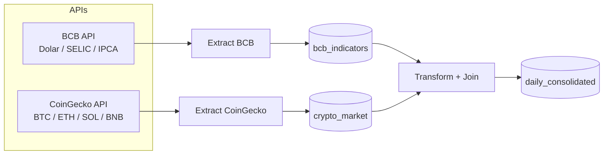
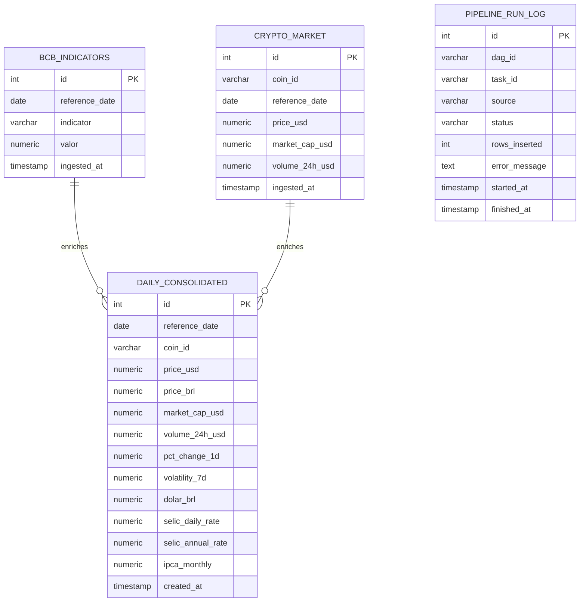

# RELATORIO TECNICO

## CAPA

**Projeto:** Integracao de dados macroeconomicos brasileiros e mercado de criptomoedas

**Disciplina:** Data Integration (2026.1)

**Instituicao:** ESPM — Sistemas de Informacao

**Professor:** Prof. Me. Andre Insardi

**Grupo:** [Preencher nomes e matriculas]

**Data:** 10 de maio de 2026

---

## SUMARIO EXECUTIVO

Este relatorio apresenta um pipeline de integracao de dados que combina series macroeconomicas do Banco Central do Brasil (BCB) e dados de mercado de criptoativos da CoinGecko. O objetivo consiste em habilitar analises sobre o impacto de variaveis macroeconomicas (dolar, SELIC e IPCA) no comportamento de ativos digitais (BTC, ETH, SOL e BNB). O pipeline foi implementado em Python, orquestrado com Apache Airflow e persistido em PostgreSQL, com infraestrutura baseada em Docker. O processo contempla extracao, tratamento, padronizacao temporal, enriquecimento com metricas de volatilidade e consolidacao em tabela analitica diaria. O resultado final e uma base pronta para consultas de valor, com rastreabilidade e idempotencia por meio de UPSERT. O Airflow executa DAGs diarias para cada etapa (BCB, CoinGecko e consolidacao), garantindo automacao e reprocessamento controlado. A solucao atende aos requisitos de integracao, qualidade e disponibilidade para analises.

---

## 1. DESCRICAO DO PROBLEMA E JUSTIFICATIVA DO TEMA

O mercado de criptoativos apresenta elevada volatilidade e e influenciado por fatores macroeconomicos. Para viabilizar analises de correlacao e comportamento, torna-se necessario integrar fontes heterogeneas (BCB e CoinGecko), com granularidades distintas e diferentes formatos temporais. O tema e relevante por conectar dados financeiros oficiais do Brasil com ativos digitais globais, fornecendo insumos para estudos de risco, impacto cambial e potencial protecao inflacionaria.

---

## 2. ARQUITETURA DA SOLUCAO

A solucao segue um pipeline ETL em tres camadas: extracao, transformacao e carga. O fluxo foi organizado para garantir idempotencia, rastreabilidade e escalabilidade operacional.

**Diagrama (Mermaid):**



---

## 3. FONTES DE DADOS E REGRAS DE TRANSFORMACAO

### 3.1 FONTES

**BCB (SGS):**
- Dolar (PTAX) — codigo 1
- SELIC — codigo 11
- IPCA — codigo 433

**CoinGecko:**
- Bitcoin (bitcoin)
- Ethereum (ethereum)
- Solana (solana)
- Binance Coin (binancecoin)

### 3.2 REGRAS DE TRANSFORMACAO

- Conversao de datas BCB: `DD/MM/YYYY` -> `DATE`.
- SELIC anualizada: `((1 + selic_diaria/100)^252 - 1) * 100`.
- IPCA mensal aplicado ao calendario diario (forward fill).
- CoinGecko: timestamps em ms -> data diaria.
- Agregacao diaria: preco (last) e volume (sum).
- Variacao diaria: `pct_change_1d`.
- Volatilidade 7 dias: desvio padrao da variacao diaria.
- Preco em BRL: `price_usd * dolar_brl`.

---

## 4. MODELAGEM DO BANCO DE DADOS

A modelagem utiliza tres tabelas principais e uma tabela de logs:

- `bcb_indicators` (raw macro)
- `crypto_market` (raw cripto)
- `daily_consolidated` (tabela analitica)
- `pipeline_run_log` (rastreamento de execucoes)

**DER/Modelo dimensional (Mermaid):**



- Fato: `daily_consolidated`
- Dimensoes implicitas: data (reference_date) e ativo (coin_id)

---

## 5. DESCRICAO DAS DAGS DO AIRFLOW

As DAGs foram implementadas com `PythonOperator`, executadas diariamente (`@daily`), com `catchup=False` e `LocalExecutor` para simplificar a execucao local. Cada DAG possui uma unica task principal e executa uma etapa especifica do ETL.

- `dag_extract_bcb` (`extract_bcb`): executa `run_bcb_extraction` e grava em `bcb_indicators`.
- `dag_extract_coingecko` (`extract_crypto`): executa `run_coingecko_extraction` e grava em `crypto_market`.
- `dag_consolidate` (`consolidate_daily_tables`): executa `run_consolidation` e grava em `daily_consolidated`.

**Dependencias logicas:** a consolidacao depende de as duas extracoes estarem atualizadas para o mesmo periodo. A execucao recomendada e BCB -> CoinGecko -> Consolidacao; como cada etapa faz UPSERT, reprocessamentos sao seguros.

---

## 6. VALIDACOES DE QUALIDADE IMPLEMENTADAS

- **Idempotencia:** UPSERT com chave unica por data e indicador/ativo.
- **Tratamento de nulos:** conversao para numerico com `errors="coerce"`.
- **Consistencia temporal:** padronizacao de datas e normalizacao para dia.
- **Forward fill:** IPCA mensal aplicado a todos os dias do mes.
- **Integridade referencial logica:** consolidacao depende de dados das duas fontes.

---

## 7. RESULTADOS (CONSULTAS DE VALOR)

A seguir, apresentam-se tres consultas de valor executadas no PostgreSQL.

### CONSULTA 1 — CORRELACAO DOLAR X BTC EM BRL

```sql
SELECT
  corr(price_brl, dolar_brl) AS corr_btc_dolar
FROM daily_consolidated
WHERE coin_id = 'bitcoin';
```

**Resultado:**

```
 corr_btc_dolar
-------------------
 0.745440789641126
```

**Screenshot:**


### CONSULTA 2 — MEDIA DE VOLATILIDADE POR ATIVO

```sql
SELECT
  coin_id,
  avg(volatility_7d) AS avg_vol_7d
FROM daily_consolidated
GROUP BY coin_id
ORDER BY avg_vol_7d DESC;
```

**Resultado:**

```
   coin_id   |     avg_vol_7d
-------------+--------------------
 solana      | 3.5336377410468320
 ethereum    | 3.3109272727272727
 binancecoin | 2.3327939393939394
 bitcoin     | 1.9717239669421488
```

**Screenshot:**


### CONSULTA 3 — SELIC ANUALIZADA VS RETORNO MEDIO DIARIO

```sql
SELECT
  coin_id,
  avg(pct_change_1d) AS avg_daily_return,
  avg(selic_annual_rate) AS avg_selic
FROM daily_consolidated
GROUP BY coin_id
ORDER BY avg_daily_return DESC;
```

**Resultado:**

```
   coin_id   |    avg_daily_return     |      avg_selic
-------------+-------------------------+---------------------
 ethereum    |  0.03474917582417582418 | 14.8287417863013699
 binancecoin |  0.03057967032967032967 | 14.8287417863013699
 bitcoin     | -0.04656565934065934066 | 14.8287417863013699
 solana      | -0.10510082417582417582 | 14.8287417863013699
```

**Screenshot:**


---

## 8. LIMITACOES E POSSIVEIS EVOLUCOES

- Dependencia de APIs publicas sujeitas a rate limit e indisponibilidade.
- Ausencia de cache historico local para reduzir chamadas.
- Escopo limitado a 4 ativos e 3 indicadores.

**Evolucoes sugeridas:**
- Adicionar mais ativos e indicadores (ex.: PIB, desemprego).
- Criar camadas historicas (Data Lake / S3).
- Agendar alertas e dashboards automatizados (Metabase/PowerBI).
- Implementar testes automatizados de qualidade e schema drift.

---

## 9. REFERENCIAS BIBLIOGRAFICAS (ABNT)

- BANCO CENTRAL DO BRASIL. Sistema Gerenciador de Series Temporais (SGS). Disponivel em: <https://api.bcb.gov.br/dados/serie/bcdata.sgs.1/dados>. Acesso em: 10 maio 2026.
- BANCO CENTRAL DO BRASIL. Sistema Gerenciador de Series Temporais (SGS). Disponivel em: <https://api.bcb.gov.br/dados/serie/bcdata.sgs.11/dados>. Acesso em: 10 maio 2026.
- BANCO CENTRAL DO BRASIL. Sistema Gerenciador de Series Temporais (SGS). Disponivel em: <https://api.bcb.gov.br/dados/serie/bcdata.sgs.433/dados>. Acesso em: 10 maio 2026.
- COINGECKO. API v3 — Market Chart. Disponivel em: <https://api.coingecko.com/api/v3/coins/bitcoin/market_chart>. Acesso em: 10 maio 2026.
- APACHE AIRFLOW. Apache Airflow Documentation. Disponivel em: <https://airflow.apache.org/docs/>. Acesso em: 10 maio 2026.
- POSTGRESQL GLOBAL DEVELOPMENT GROUP. PostgreSQL Documentation. Disponivel em: <https://www.postgresql.org/docs/>. Acesso em: 10 maio 2026.

---

## ANEXOS (OPCIONAL)

- Diagrama de arquitetura (Mermaid)
- Diagrama ER / modelo dimensional (Mermaid)
- Prints do Airflow (grid/graph/log) e das consultas SQL

